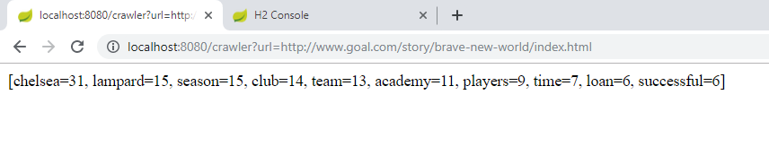
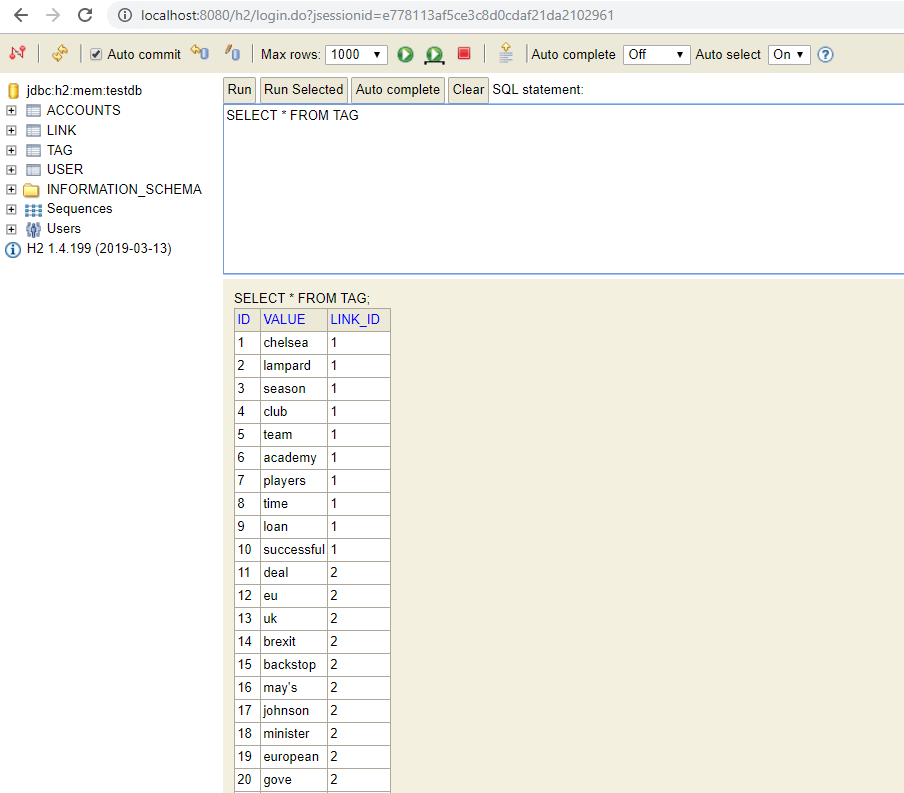
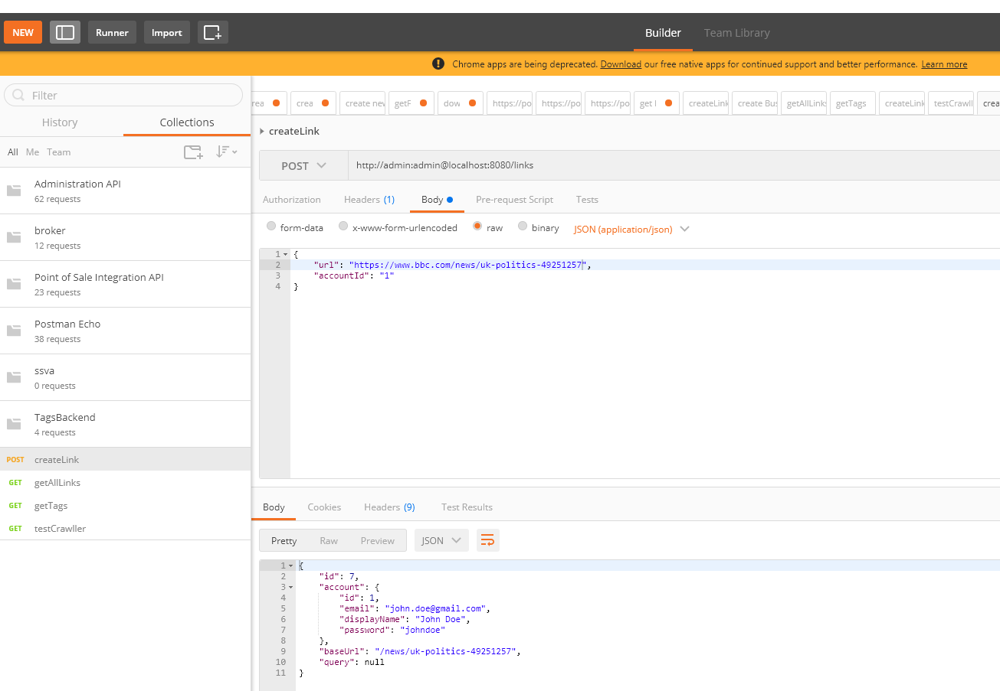

##Tags Backend applicaiton

- Used technologies: `Java, Spring Boot, Maven, H2 (in memory db), Jsoup, Lombock, Slf4j`

#### Project setup
- It can be imported in inteliJ -> new Project from existing sources
- It should be imported as maven project

#### To build the app run: `mvn clean install`

#### To Start the app run: `mvn spring-boot:run`
- app is running on standard port `8080`  

#### Database
- for faster development I decided to use H2 inmemory database, 
    - the reviewer does not need to do any setup
    - saved me some time not to create separate db and write SQL statements to initialize it
- can be accessed at `http://localhost:8080/h2` (the creadentials can be found in application.properties)
- if I had more time I would go with `PostgreSQL` db and using `Flyway` migration scripts for versioning 

 
#### Tests
- default application contexts test that checks if application context is starting properly
- TextUtilTest unit test the text processing functionalities of the util
- TestController is added that can be used for testing web page text parsing 
    - `http://localhost:8080/crawler?url=https://en.wikipedia.org/wiki/Korea`  
- postman collection is provided in the project

#### Example links and results 
`http://localhost:8080/crawler?url=https://www.bbc.com/news/uk-politics-49251257`  
`[deal=20, eu=20, uk=11, brexit=11, backstop=6, may's=5, johnson=4, minister=4, european=4, gove=4]`

`http://localhost:8080/crawler?url=http://www.goal.com/story/brave-new-world/index.html`  
`[chelsea=31, lampard=15, season=15, club=14, team=13, academy=11, players=9, time=7, loan=6, successful=6]`

#### Possible improvements
- user management is implemented
- standalone database
- better exception handling and logging
- pagination for large list of response or streaming
- more unit tests and postman requests
- java docs are added
- mapstruct library is used for domain to DTO(data transfer objects) mapping
- passwords should be hashed
- data.sql entries are not existing when app is started (needs to be investigated why)

#### Screenshots
  

  

